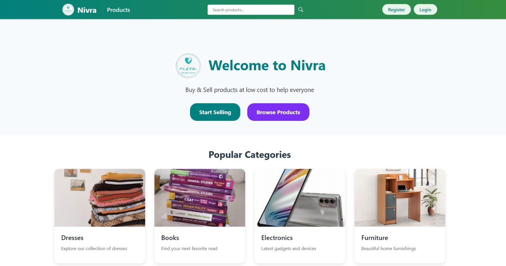
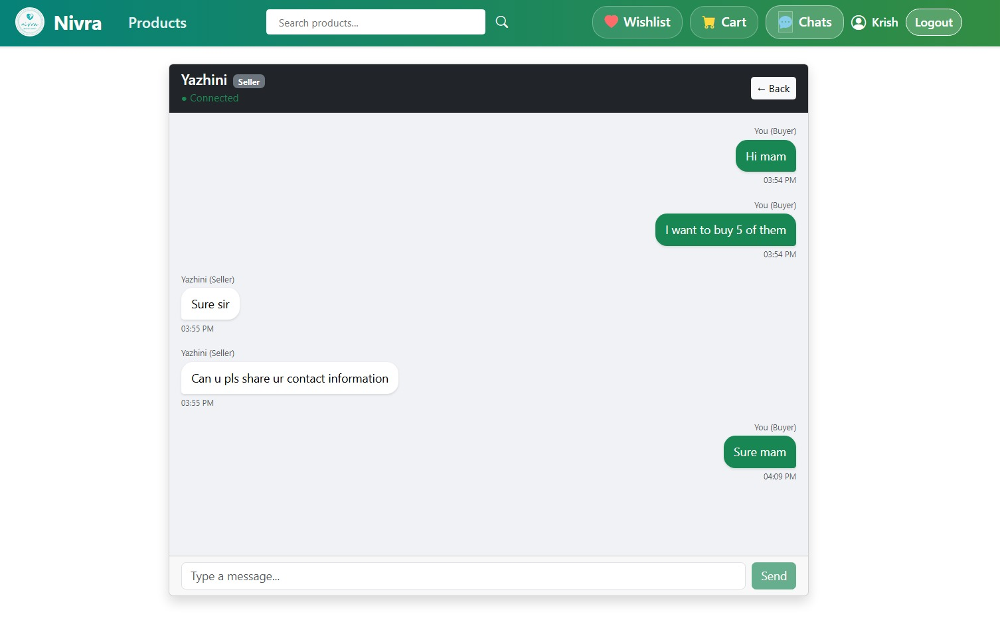
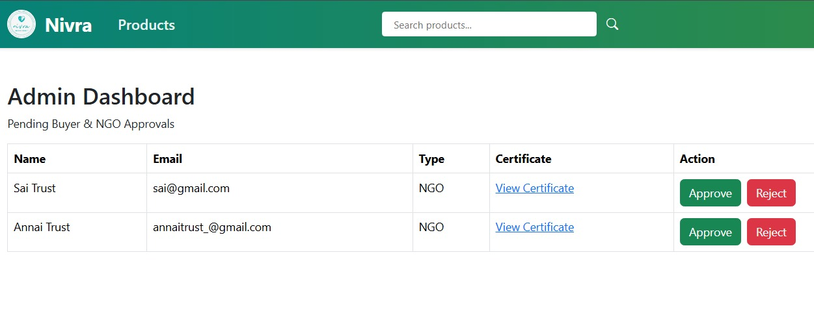
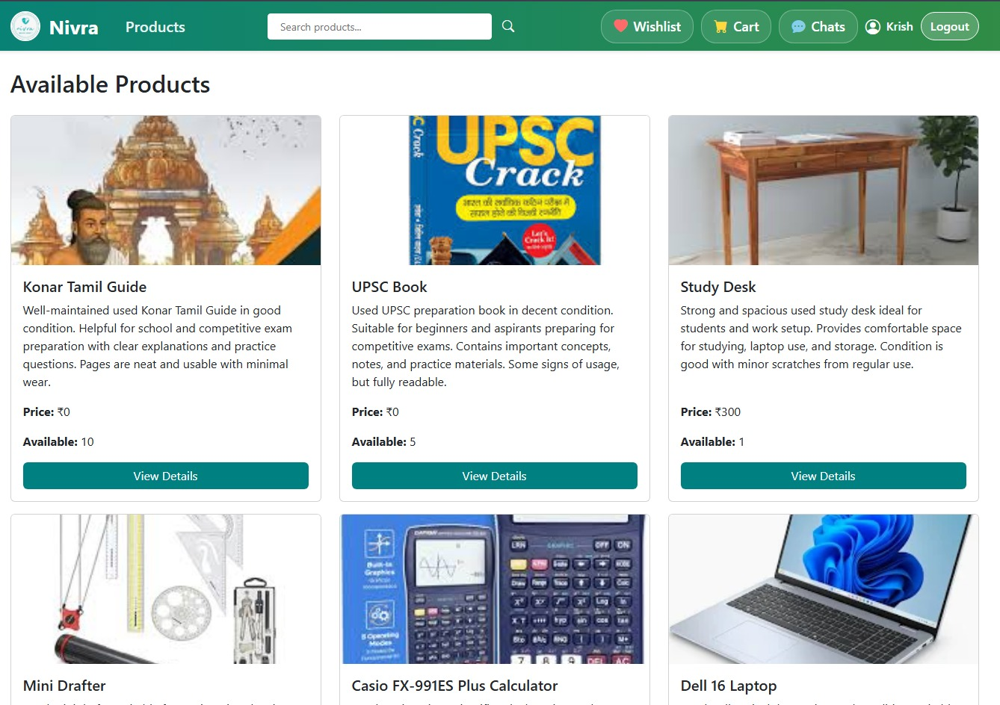
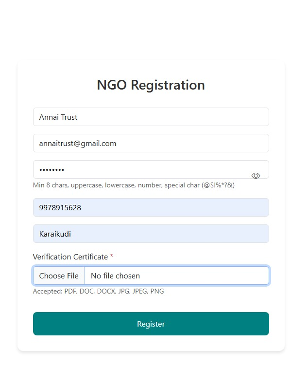

# NIVRA — Donation Platform

> Connecting sellers, needy buyers, and NGOs to facilitate product donations through a verified, transparent platform.

---

## What is NIVRA?

NIVRA is a full-stack web application that bridges the gap between people who want to donate products and those who genuinely need them. Sellers list items for donation, NGOs and verified needy buyers request them, and an admin ensures every participant is legitimate before any exchange happens.

**The problem it solves:** Unused goods often go to waste while many people lack access to basic necessities. NIVRA creates a structured, trusted pipeline for product donations — not cash, but actual goods.

---

## How it works

```
Seller lists product
        ↓
Buyer / NGO sends request
        ↓
Admin verifies & approves users
        ↓
Buyer contacts Seller via in-app chat
        ↓
Donation happens
```

---

## Features

**For Sellers**
- Register and list products available for donation
- Upload product images (up to 10MB)
- View and manage incoming donation requests
- Chat with approved buyers directly

**For Buyers / NGOs**
- Register and await admin verification
- Browse available donated products
- Send donation requests to sellers
- Chat with sellers once connected

**For Admin**
- View all pending buyer and NGO registrations
- Approve or reject users before they can interact
- Manage platform integrity

**Authentication & Security**
- Role-based access control (SELLER, BUYER, ADMIN)
- Session-based login with Spring Security
- Admin login endpoint protected separately
- CORS configured for frontend–backend separation

---

## Tech Stack

| Layer | Technology |
|-------|-----------|
| Frontend | React.js (Vite) |
| Backend | Java, Spring Boot |
| Database | MySQL |
| ORM | Spring Data JPA / Hibernate |
| API Style | RESTful APIs |
| File Upload | Spring Multipart (max 10MB) |
| Version Control | Git & GitHub |
| Dev Tools | VS Code, IntelliJ IDEA, Postman, MySQL Workbench |

---

## Project Structure

```
Nivra/
├── backend/
│   └── src/main/java/com/project/nivra/
│       ├── controller/
│       │   ├── AuthController.java          # Login, register
│       │   ├── UserController.java          # Admin: approve/reject users
│       │   ├── ProductController.java       # CRUD for donation listings
│       │   ├── RequestController.java       # Donation request management
│       │   ├── ConversationController.java  # Chat thread management
│       │   └── MessageController.java       # Real-time messages
│       ├── model/
│       │   ├── User.java                    # Role: SELLER / BUYER / ADMIN
│       │   └── ...
│       ├── repository/
│       │   ├── UserRepository.java
│       │   ├── ProductRepository.java
│       │   ├── RequestRepository.java
│       │   ├── ConversationRepository.java
│       │   └── MessageRepository.java
│       └── service/
│           └── AuthService.java
│
├── frontend/
│   └── src/
│       ├── components/
│       │   ├── Navbar.jsx
│       │   ├── ProductForm.jsx
│       │   └── SellerRequests.jsx
│       └── ...
│
└── README.md
```

---

## Getting Started

### Prerequisites

- Java 17+
- Node.js 18+
- MySQL 8.0+
- Maven

### Backend Setup

```bash
# 1. Clone the repository
git clone https://github.com/Nithya-purnima/Nivra.git
cd Nivra/backend

# 2. Create the database
mysql -u root -p
CREATE DATABASE nivradb;

# 3. Configure application.properties
# Edit src/main/resources/application.properties
spring.datasource.url=jdbc:mysql://localhost:3306/nivradb
spring.datasource.username=your_username
spring.datasource.password=your_password

# 4. Run the backend
mvn spring-boot:run
# Runs on http://localhost:8080
```

### Frontend Setup

```bash
cd Nivra/frontend

# Install dependencies
npm install

# Start development server
npm run dev
# Runs on http://localhost:5173
```

---

## API Endpoints

| Method | Endpoint | Description | Access |
|--------|----------|-------------|--------|
| POST | `/api/users/admin/login` | Admin login | Public |
| GET | `/api/users/admin/pending` | Get unverified users | Admin |
| PUT | `/api/users/admin/approve/{id}` | Approve a user | Admin |
| DELETE | `/api/users/admin/reject/{id}` | Reject a user | Admin |
| POST | `/api/auth/register` | Register new user | Public |
| POST | `/api/auth/login` | User login | Public |
| GET | `/api/products` | List all products | Authenticated |
| POST | `/api/products` | Add donation listing | Seller |
| POST | `/api/requests` | Request a donation | Buyer |
| GET | `/api/conversations` | Get chat threads | Authenticated |
| POST | `/api/messages` | Send a message | Authenticated |

---

## Database Schema (Key Tables)

**users** — id, name, email, password, role (SELLER/BUYER/ADMIN), verified (boolean)

**products** — id, title, description, image_url, seller_id, available (boolean)

**requests** — id, product_id, buyer_id, status (PENDING/APPROVED/REJECTED)

**conversations** — id, seller_id, buyer_id

**messages** — id, conversation_id, sender_id, content, timestamp

---

## Screenshots








---

## Future Improvements

- Email notifications on request approval
- Location-based product filtering
- NGO verification with document upload
- Mobile-responsive PWA version
- Rating system for completed donations

---

## Team

**Nithya Purnima B** — Full Stack Developer
B.E. Computer Science Engineering, ACGCET (2023–2027)

---

## License

This project is built for academic purposes.
